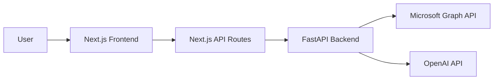

# System Architecture & Data Flow

This document details how the Quotable application works, specifically focusing on the interaction between the Next.js Frontend and the FastAPI Backend, and the flow of data for fetching and analyzing emails.

## 1. High-Level Architecture

The application uses a 3-tier architecture:

1.  **Frontend (UI)**: Next.js (React) application. Handles user interaction and state.
2.  **Frontend Proxy (BFF)**: Next.js Route Handlers (`/app/api/...`). Acts as a Backend-for-Frontend layer to proxy requests to the Python backend, handling headers and CORS if necessary.
3.  **Backend (API)**: FastAPI (Python) application. Contains the business logic, services, and integrations with external providers (Microsoft Graph, OpenAI).



---

## 2. Feature: Fetching Emails

This flow describes how emails are retrieved from Outlook and displayed in the inbox.

### Step-by-Step Flow

1.  **Frontend Trigger**:
    *   **File**: `frontend/app/quotable/[uid]/inbox/page.tsx`
    *   **Action**: Component mounts or user paginates. `useEffect` calls `fetchEmails()`.
    *   **Call**: `axios.get("/api/email", ...)`

2.  **Frontend Proxy**:
    *   **File**: `frontend/app/api/email/route.ts`
    *   **Logic**: Receives the request from the browser. It reads the `X-Session-Id` header and forwards the request to the Python backend (`http://localhost:8000/emails`).

3.  **Backend Route**:
    *   **File**: `backend/src/api/v1/email_routes.py`
    *   **Function**: `get_emails` (@router.get(""))
    *   **Logic**: Validates the session token using `get_service_or_401` and calls the `EmailService`.

4.  **Backend Service**:
    *   **File**: `backend/src/services/email/service.py`
    *   **Class**: `EmailService`
    *   **Method**: `get_emails`
    *   **Logic**:
        *   Constructs a Microsoft Graph API query.
        *   Applies filters (read/unread, date).
        *   **Crucial Detail**: Uses `$expand=attachments` to fetch attachment metadata (name, type) in the same call to avoid N+1 queries.
        *   Sends HTTP GET to `https://graph.microsoft.com/v1.0/me/mailFolders/inbox/messages`.

5.  **Schema/Response**:
    *   **File**: `backend/src/schemas/email.py`
    *   **Model**: `EmailListResponse` containing list of `EmailResponse`.
    *   **Return**: The structured JSON is returned up the chain to the frontend `EmailList` component.

---

## 3. Feature: AI Email Analysis

This flow describes what happens when a user clicks the "Analyze" button to extract product opportunities.

### Step-by-Step Flow

1.  **Frontend Trigger**:
    *   **File**: `frontend/components/email/email-detail.tsx` -> `frontend/app/quotable/[uid]/inbox/page.tsx`
    *   **Action**: User clicks the "Analyze" button.
    *   **Function**: `handleAnalyzeEmail` in `page.tsx` executes.
    *   **Call**: `axios.post("/api/email/{id}/analyze")`

2.  **Frontend Proxy**:
    *   **File**: `frontend/app/api/email/[id]/analyze/route.ts`
    *   **Logic**: Creates a dynamic route handler for the specific email ID. Forwards the POST request to the backend: `http://localhost:8000/emails/{id}/analyze`.

3.  **Backend Orchestration (The "Brain")**:
    *   **File**: `backend/src/api/v1/email_routes.py`
    *   **Function**: `analyze_email` endpoint.
    *   **Logic**: This endpoint acts as an **orchestrator**:
        1.  **Fetch Data**: Calls `EmailService.get_email(id)` to retrieve the latest subject and body from Microsoft Graph.
        2.  **Analyze Intent**: Calls `LLMService.analyze_email_intent(subject, body)`.
        3.  **Conditional Extraction**: If `intent.is_customer_request` is `True`, it calls `LLMService.extract_product_data(subject, body)`.
        4.  **Merge**: Combines intent and product data into a single response.

4.  **LLM Service**:
    *   **File**: `backend/src/services/llm/service.py`
    *   **Logic**:
        *   Prepares messages using templates from `backend/src/services/llm/prompts.py`.
        *   Calls the OpenAI Client.
        *   **Prompts**: Uses `CUSTOMER_REQUEST_SYSTEM_PROMPT` to classify and `PRODUCT_EXTRACTION_SYSTEM_PROMPT` to extract data.

5.  **OpenAI Integration**:
    *   **File**: `backend/src/services/llm/clients/openai_client.py`
    *   **Logic**: Wraps the standard OpenAI library. Configured with `OPENAI_API_KEY` from `.env`. Sends request to GPT-4o (or configured model) and returns the text response.

6.  **Frontend Display**:
    *   **File**: `frontend/components/email/email-opportunity.tsx`
    *   **Logic**: Receives the `EmailAnalysisResponse` JSON. Displays the "Customer Request" badge, confidence score, reasoning, and a list of extracted products.

---

## 4. Key Schemas & Models

Data structures are shared via Pydantic models in the backend to ensure type safety.

*   **File**: `backend/src/schemas/email.py`
    *   `EmailResponse`: Defines the structure of an email object (subject, sender, body, attachments).
    *   `EmailAnalysisResponse`: The output of the analysis endpoint.
        ```python
        class EmailAnalysisResponse(BaseModel):
            is_customer_request: bool
            confidence: float
            reasoning: str
            products: List[Product]
        ```

*   **File**: `backend/src/schemas/products.py`
    *   `Product`: Defines extracted product data (name, quantity, part_number, description).

## 5. File Map Summary

| Component | Frontend File | Backend File |
| :--- | :--- | :--- |
| **Page/Layout** | `frontend/app/quotable/[uid]/inbox/page.tsx` | N/A |
| **Email List** | `frontend/components/email/email-list.tsx` | `backend/src/api/v1/email_routes.py` (get_emails) |
| **Email Detail** | `frontend/components/email/email-detail.tsx` | `backend/src/api/v1/email_routes.py` (get_email) |
| **AI Analysis UI**| `frontend/components/email/email-opportunity.tsx` | `backend/src/services/llm/service.py` |
| **Proxy Route** | `frontend/app/api/email/route.ts` | `backend/src/main.py` (Router inclusion) |
| **Models** | TypeScript Interfaces (in components) | `backend/src/schemas/*.py` |
